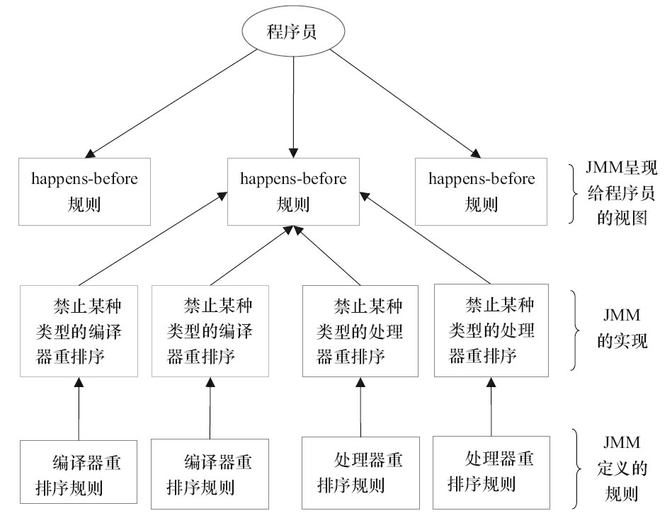

# happens-before

happens-before的概念最初由Leslie Lamport在其一篇影响深远的论文（《Time，Clocks and the Ordering of Events in a Distributed System》）中提出。Leslie Lamport使用happens-before来定义分布式系统中事件之间的偏序关系（partial ordering）。Leslie Lamport在这篇论文中给出了一个分布式算法，该算法可以将该偏序关系扩展为某种全序关系。

JSR-133使用happens-before的概念来指定两个操作之间的执行顺序。由于这两个操作可以在一个线程之内，也可以是在不同线程之间。因此，JMM可以通过happens-before关系向程序员提供跨线程的内存可见性保证（如果A线程的写操作a与B线程的读操作b之间存在happens-before关系，尽管a操作和b操作在不同的线程中执行，但JMM向程序员保证a操作将对b操作可见）。

《JSR-133:Java Memory Model and Thread Specification》对happens-before关系的定义如下。

1）如果一个操作happens-before另一个操作，那么第一个操作的执行结果将对第二个操作可见，而且第一个操作的执行顺序排在第二个操作之前。

2）两个操作之间存在happens-before关系，并不意味着Java平台的具体实现必须要按照happens-before关系指定的顺序来执行。如果重排序之后的执行结果，与按happens-before关系来执行的结果一致，那么这种重排序并不非法（也就是说，JMM允许这种重排序）。上面的1）是JMM对程序员的承诺。从程序员的角度来说，可以这样理解happens-before关系：如果A happens-before B，那么Java内存模型将向程序员保证——A操作的结果将对B可见，且A的执行顺序排在B之前。注意，这只是Java内存模型向程序员做出的保证！上面的2）是JMM对编译器和处理器重排序的约束原则。正如前面所言，JMM其实是在遵循一个基本原则：只要不改变程序的执行结果（指的是单线程程序和正确同步的多线程程序），编译器和处理器怎么优化都行。JMM这么做的原因是：程序员对于这两个操作是否真的被重排序并不关心，程序员关心的是程序执行时的语义不能被改变（即执行结果不能被改变）。因此，happens-before关系本质上和as-if-serial语义是一回事。

as-if-serial语义保证单线程内程序的执行结果不被改变，happens-before关系保证正确同步的多线程程序的执行结果不被改变。

as-if-serial语义给编写单线程程序的程序员创造了一个幻境：单线程程序是按程序的顺序来执行的。

happens-before关系给编写正确同步的多线程程序的程序员创造了一个幻境：正确同步的多线程程序是按happens-before指定的顺序来执行的。

as-if-serial语义和happens-before这么做的目的，都是为了在不改变程序执行结果的前提下，尽可能地提高程序执行的并行度。

从JDK 5开始，Java使用新的JSR-133内存模型（除非特别说明，本文针对的都是JSR-133内存模型）。JSR-133使用happens-before的概念来阐述操作之间的内存可见性。在JMM中，如果一个操作执行的结果需要对另一个操作可见，那么这两个操作之间必须要存在happens-before关系。这里提到的两个操作既可以是在一个线程之内，也可以是在不同线程之间。

与程序员密切相关的happens-before规则如下。

1. 程序顺序规则：一个线程中的每个操作，happens-before于该线程中的任意后续操作。
2. 监视器锁规则：对一个锁的解锁，happens-before于随后对这个锁的加锁。
3. volatile变量规则：对一个volatile域的写，happens-before于任意后续对这个volatile域的读。
4. 线程启动规则：Thread 对象的 start\(\)方法 happen—before 此线程的每一个动作。
5. 线程终止规则：线程的所有操作都 happen—before 对此线程的终止检测，可以通过 Thread.join\(\)方法结束 Thread.isAlive\(\)的返回值等手段检测到线程已经终止执行。
6. 线程中断规则：对线程 interrupt\(\)方法的调用 happen—before 发生于被中断线程的代码检测到中断时事件的发生。
7. 对象终结规则：一个对象的初始化完成（构造函数执行结束）happen—before 它的 finalize\(\)方法的开始。
8. 传递性：如果A happens-before B，且B happens-before C，那么A happens-before C。

注意 两个操作之间具有happens-before关系，并不意味着前一个操作必须要在后一个操作之前执行！happens-before仅仅要求前一个操作（执行的结果）对后一个操作可见，且前一个操作按顺序排在第二个操作之前（the first is visible to and ordered before the second）。happens-before的定义很微妙，后文会具体说明happens-before为什么要这么定义。

happens-before与JMM的关系如图1所示。

图1

如图1所示，一个happens-before规则对应于一个或多个编译器和处理器重排序规则。对于Java程序员来说，happens-before规则简单易懂，它避免Java程序员为了理解JMM提供的内存可见性保证而去学习复杂的重排序规则以及这些规则的具体实现方法。

一个常用来分析的例子如下：

```text
private int value = 0;  

public int get(){  
    return value;  
}  
public void set(int value){  
    this.value = value;  
}
```

假设存在线程 A 和线程 B，线程 A 先（时间上的先）调用了 setValue\(3\)操作，然后（时间上的后）线程B调用了同一对象的 getValue\(\)方法，那么线程B得到的返回值一定是3吗？

对照以上八条 happen—before 规则，发现没有一条规则适合于这里的 value 变量，从而我们可以判定线程 A 中的 setValue\(3\)操作与线程 B 中的 getValue\(\)操作不存在 happen—before 关系。因此，尽管线程 A 的 setValue\(3\)在操作时间上先于操作 B 的 getvalue\(\)，但无法保证线程 B 的 getValue\(\)操作一定观察到了线程 A 的 setValue\(3\)操作所产生的结果，也即是 getValue\(\)的返回值不一定为 3（有可能是之前 setValue 所设置的值）。这里的操作不是线程安全的。

因此，”一个操作时间上先发生于另一个操作“并不代表”一个操作 happen—before 另一个操作“。

解决方法：可以将 setValue（int）方法和 getValue\(\)方法均定义为 synchronized 方法，也可以把 value 定义为 volatile 变量（value 的修改并不依赖 value 的原值，符合 volatile 的使用场景），分别对应 happen—before 规则的第 2 和第 3 条。注意，只将 setValue（int）方法和 getvalue\(\)方法中的一个定义为 synchronized 方法是不行的，必须对同一个变量的所有读写同步，才能保证不读取到陈旧的数据，仅仅同步读或写是不够的 。

其次来看，操作 A happen—before 操作 B，是否意味着操作 A 在时间上先与操作 B 发生？

看有如下代码：

```text
x = 1；  
y = 2;
```

假设同一个线程执行上面两个操作：操作 A：x=1 和操作 B：y=2。根据 happen—before 规则的第 1 条，操作 A happen—before 操作 B，但是由于编译器的指令重排序（Java 语言规范规定了 JVM 线程内部维持顺序化语义，也就是说只要程序的最终结果等同于它在严格的顺序化环境下的结果，那么指令的执行顺序就可能与代码的顺序不一致。这个过程通过叫做指令的重排序。指令重排序存在的意义在于：JVM 能够根据处理器的特性（CPU 的多级缓存系统、多核处理器等）适当的重新排序机器指令，使机器指令更符合 CPU 的执行特点，最大限度的发挥机器的性能。在没有同步的情况下，编译器、处理器以及运行时等都可能对操作的执行顺序进行一些意想不到的调整）等原因，操作 A 在时间上有可能后于操作 B 被处理器执行，但这并不影响 happen—before 原则的正确性。

因此，”一个操作 happen—before 另一个操作“并不代表”一个操作时间上先发生于另一个操作“。

最后，一个操作和另一个操作必定存在某个顺序，要么一个操作或者是先于或者是后于另一个操作，或者与两个操作同时发生。同时发生是完全可能存在的，特别是在多 CPU 的情况下。而两个操作之间却可能没有 happen-before 关系，也就是说有可能发生这样的情况，操作 A 不 happen-before 操作 B，操作 B 也不 happen-before 操作 A，用数学上的术语 happen-before 关系是个偏序关系。两个存在 happen-before 关系的操作不可能同时发生，一个操作 A happen-before 操作 B，它们必定在时间上是完全错开的，这实际上也是同步的语义之一（独占访问）。

## 利用 happen—before 规则分析 DCL <a id="a97ca8f6e329e6d3f916389f2457b0e7"></a>

DCL 即双重检查加锁，下面是一个典型的在单例模式中使用 DCL 的例子：

```text
public class LazySingleton {  
    private int someField;  

    private static LazySingleton instance;  

    private LazySingleton() {  
        this.someField = new Random().nextInt(200)+1;         // (1)  
    }  

    public static LazySingleton getInstance() {  
        if (instance == null) {                               // (2)  
            synchronized(LazySingleton.class) {               // (3)  
                if (instance == null) {                       // (4)  
                    instance = new LazySingleton();           // (5)  
                }  
            }  
        }  
        return instance;                                      // (6)  
    }  

    public int getSomeField() {  
        return this.someField;                                // (7)  
    }  
}
```

这里得到单一的 instance 实例是没有问题的，问题的关键在于尽管得到了 Singleton 的正确引用，但是却有可能访问到其成员变量的不正确值。具体来说 Singleton.getInstance\(\).getSomeField\(\) 有可能返回 someField 的默认值 0。如果程序行为正确的话，这应当是不可能发生的事，因为在构造函数里设置的 someField 的值不可能为 0。为也说明这种情况理论上有可能发生，我们只需要说明语句\(1\)和语句\(7\)并不存在 happen-before 关系。

假设线程Ⅰ是初次调用 getInstance\(\)方法，紧接着线程Ⅱ也调用了 getInstance\(\)方法和 getSomeField\(\)方法，我们要说明的是线程Ⅰ的语句\(1\)并不 happen-before 线程Ⅱ的语句\(7\)。线程Ⅱ在执行 getInstance\(\)方法的语句\(2\)时，由于对 instance 的访问并没有处于同步块中，因此线程Ⅱ可能观察到也可能观察不到线程Ⅰ在语句\(5\)时对 instance 的写入，也就是说 instance 的值可能为空也可能为非空。我们先假设 instance 的值非空，也就观察到了线程Ⅰ对 instance 的写入，这时线程Ⅱ就会执行语句\(6\)直接返回这个 instance 的值，然后对这个 instance 调用 getSomeField\(\)方法，该方法也是在没有任何同步情况被调用，因此整个线程Ⅱ的操作都是在没有同步的情况下调用 ，这时我们便无法利用上述 8 条 happen-before 规则得到线程Ⅰ的操作和线程Ⅱ的操作之间的任何有效的 happen-before 关系（主要考虑规则的第 2 条，但由于线程Ⅱ没有在进入 synchronized 块，因此不存在 lock 与 unlock 锁的问题），这说明线程Ⅰ的语句\(1\)和线程Ⅱ的语句\(7\)之间并不存在 happen-before 关系，这就意味着线程Ⅱ在执行语句\(7\)完全有可能观测不到线程Ⅰ在语句\(1\)处对 someFiled 写入的值，这就是 DCL 的问题所在。很荒谬，是吧？DCL 原本是为了逃避同步，它达到了这个目的，也正是因为如此，它最终受到惩罚，这样的程序存在严重的 bug，虽然这种 bug 被发现的概率绝对比中彩票的概率还要低得多，而且是转瞬即逝，更可怕的是，即使发生了你也不会想到是 DCL 所引起的。

前面我们说了，线程Ⅱ在执行语句\(2\)时也有可能观察空值，如果是种情况，那么它需要进入同步块，并执行语句\(4\)。在语句\(4\)处线程Ⅱ还能够读到 instance 的空值吗？不可能。这里因为这时对 instance 的写和读都是发生在同一个锁确定的同步块中，这时读到的数据是最新的数据。为也加深印象，我再用 happen-before 规则分析一遍。线程Ⅱ在语句\(3\)处会执行一个 lock 操作，而线程Ⅰ在语句\(5\)后会执行一个 unlock 操作，这两个操作都是针对同一个锁--Singleton.class，因此根据第 2 条 happen-before 规则，线程Ⅰ的 unlock 操作 happen-before 线程Ⅱ的 lock 操作，再利用单线程规则，线程Ⅰ的语句\(5\) -&gt; 线程Ⅰ的 unlock 操作，线程Ⅱ的 lock 操作 -&gt; 线程Ⅱ的语句\(4\)，再根据传递规则，就有线程Ⅰ的语句\(5\) -&gt; 线程Ⅱ的语句\(4\)，也就是说线程Ⅱ在执行语句\(4\)时能够观测到线程Ⅰ在语句\(5\)时对 Singleton 的写入值。接着对返回的 instance 调用 getSomeField\(\)方法时，我们也能得到线程Ⅰ的语句\(1\) -&gt; 线程Ⅱ的语句\(7\)（由于线程Ⅱ有进入 synchronized 块，根据规则 2 可得），这表明这时 getSomeField 能够得到正确的值。但是仅仅是这种情况的正确性并不妨碍 DCL 的不正确性，一个程序的正确性必须在所有的情况下的行为都是正确的，而不能有时正确，有时不正确。

对 DCL 的分析也告诉我们一条经验原则：对引用（包括对象引用和数组引用）的非同步访问，即使得到该引用的最新值，却并不能保证也能得到其成员变量（对数组而言就是每个数组元素）的最新值。

## 解决方案 <a id="de842a6c80128bf1587c7cd451914e7a"></a>

最简单而且安全的解决方法是使用 static 内部类的思想，它利用的思想是：一个类直到被使用时才被初始化，而类初始化的过程是非并行的，这些都有 JLS 保证。

如下述代码：

```text
public class Singleton {  

  private Singleton() {}  

  // Lazy initialization holder class idiom for static fields  
  private static class InstanceHolder {  
   private static final Singleton instance = new Singleton();  
  }  

  public static Singleton getSingleton() {   
    return InstanceHolder.instance;   
  }  
}
```

另外，可以将 instance 声明为 volatile，即

**private volatile static LazySingleton instance;**

这样我们便可以得到，线程Ⅰ的语句\(5\) -&gt; 语线程Ⅱ的句\(2\)，根据单线程规则，线程Ⅰ的语句\(1\) -&gt; 线程Ⅰ的语句\(5\)和语线程Ⅱ的句\(2\) -&gt; 语线程Ⅱ的句\(7\)，再根据传递规则就有线程Ⅰ的语句\(1\) -&gt; 语线程Ⅱ的句\(7\)，这表示线程Ⅱ能够观察到线程Ⅰ在语句\(1\)时对 someFiled 的写入值，程序能够得到正确的行为。

> 注： 1、volatile 屏蔽指令重排序的语义在 JDK1.5 中才被完全修复，此前的 JDK 中及时将变量声明为 volatile，也仍然不能完全避免重排序所导致的问题（主要是 volatile 变量前后的代码仍然存在重排序问题），这点也是在 JDK1.5 之前的 Java 中无法安全使用 DCL 来实现单例模式的原因。
>
> 2、把 volatile 写和 volatile 读这两个操作综合起来看，在读线程 B 读一个 volatile 变量后，写线程 A 在写这个 volatile 变量之前，所有可见的共享变量的值都将立即变得对读线程 B 可见。
>
> 3、 在 java5 之前对 final 字段的同步语义和其它变量没有什么区别，在 java5 中，final 变量一旦在构造函数中设置完成（前提是在构造函数中没有泄露 this 引用\)，其它线程必定会看到在构造函数中设置的值。而 DCL 的问题正好在于看到对象的成员变量的默认值，因此我们可以将 LazySingleton的someField 变量设置成 final，这样在 java5 中就能够正确运行了。

