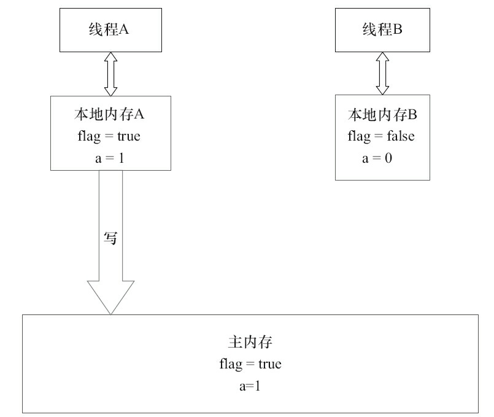

# volatile写-读的内存语义

**volatile写的内存语义如下：**

当写一个volatile变量时，JMM会把该线程对应的本地内存中的共享变量值刷新到主内存。以上面示例程序VolatileExample为例，假设线程A首先执行writer\(\)方法，随后线程B执行reader\(\)方法，初始时两个线程的本地内存中的flag和a都是初始状态。图1是线程A执行volatile写后，共享变量的状态示意图。

图1

如图1所示，线程A在写flag变量后，本地内存A中被线程A更新过的两个共享变量的值被刷新到主内存中。此时，本地内存A和主内存中的共享变量的值是一致的。

**volatile读的内存语义如下：**

当读一个volatile变量时，JMM会把该线程对应的本地内存置为无效。线程接下来将从主内存中读取共享变量。

图2为线程B读同一个volatile变量后，共享变量的状态示意图。如图所示，在读flag变量后，本地内存B包含的值已经被置为无效。此时，线程B必须从主内存中读取共享变量。线程B的读取操作将导致本地内存B与主内存中的共享变量的值变成一致。

如果我们把volatile写和volatile读两个步骤综合起来看的话，在读线程B读一个volatile变量后，写线程A在写这个volatile变量之前所有可见的共享变量的值都将立即变得对读线程B可见。

**下面对volatile写和volatile读的内存语义做个总结：**

线程A写一个volatile变量，实质上是线程A向接下来将要读这个volatile变量的某个线程发出了（其对共享变量所做修改的）消息。

·线程B读一个volatile变量，实质上是线程B接收了之前某个线程发出的（在写这个volatile变量之前对共享变量所做修改的）消息。

·线程A写一个volatile变量，随后线程B读这个volatile变量，这个过程实质上是线程A通过主内存向线程B发送消息。

图2

