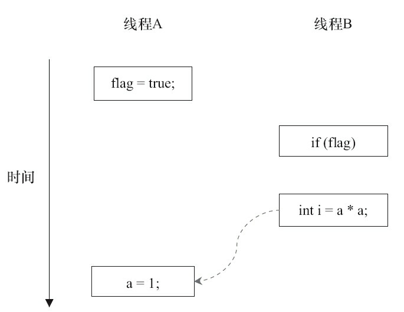
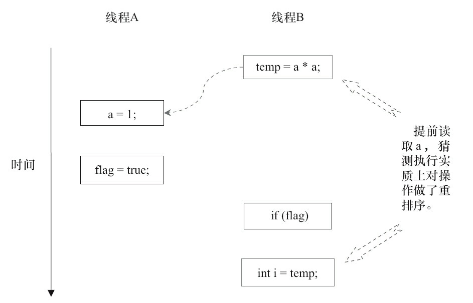

# 重排序对多线程的影响

现在让我们来看看，重排序是否会改变多线程程序的执行结果。请看下面的示例代码。

```text
class ReorderExample {
    int a = 0;
    boolean flag = false;

    public void writer() {
        a = 1; // 1
        flag = true; // 2
    }

    public void reader() {
        if (flag) { // 3
            int i = a * a; // 4
        ……
        }
    }
}
```

flag变量是个标记，用来标识变量a是否已被写入。这里假设有两个线程A和B，A首先执行writer\(\)方法，随后B线程接着执行reader\(\)方法。线程B在执行操作4时，能否看到线程A在操作1对共享变量a的写入呢？

答案是：不一定能看到。

由于操作1和操作2没有数据依赖关系，编译器和处理器可以对这两个操作重排序；同样，操作3和操作4没有数据依赖关系，编译器和处理器也可以对这两个操作重排序。让我们先来看看，当操作1和操作2重排序时，可能会产生什么效果？请看下面的程序执行时序图，如图1所示。

图1



如图1所示，操作1和操作2做了重排序。程序执行时，线程A首先写标记变量flag，随后线程B读这个变量。由于条件判断为真，线程B将读取变量a。此时，变量a还没有被线程A写入，在这里多线程程序的语义被重排序破坏了！

注意 本文统一用虚箭线标识错误的读操作，用实箭线标识正确的读操作。下面再让我们看看，当操作3和操作4重排序时会产生什么效果（借助这个重排序，可以顺便说明控制依赖性）。下面是操作3和操作4重排序后，程序执行的时序图，如图2所示。

图2

在程序中，操作3和操作4存在控制依赖关系。当代码中存在控制依赖性时，会影响指令序列执行的并行度。为此，编译器和处理器会采用猜测（Speculation）执行来克服控制相关性对并行度的影响。以处理器的猜测执行为例，执行线程B的处理器可以提前读取并计算a\*a，然后把计算结果临时保存到一个名为重排序缓冲（Reorder Buffer，ROB）的硬件缓存中。当操作3的条件判断为真时，就把该计算结果写入变量i中。从图2中我们可以看出，猜测执行实质上对操作3和4做了重排序。重排序在这里破坏了多线程程序的语义！

在单线程程序中，对存在控制依赖的操作重排序，不会改变执行结果（这也是as-if-serial语义允许对存在控制依赖的操作做重排序的原因）；但在多线程程序中，对存在控制依赖的操作重排序，可能会改变程序的执行结果。

